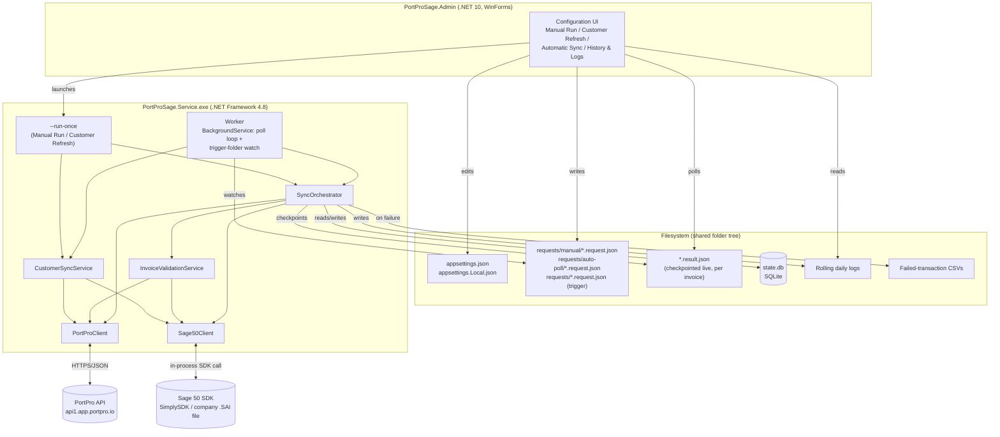
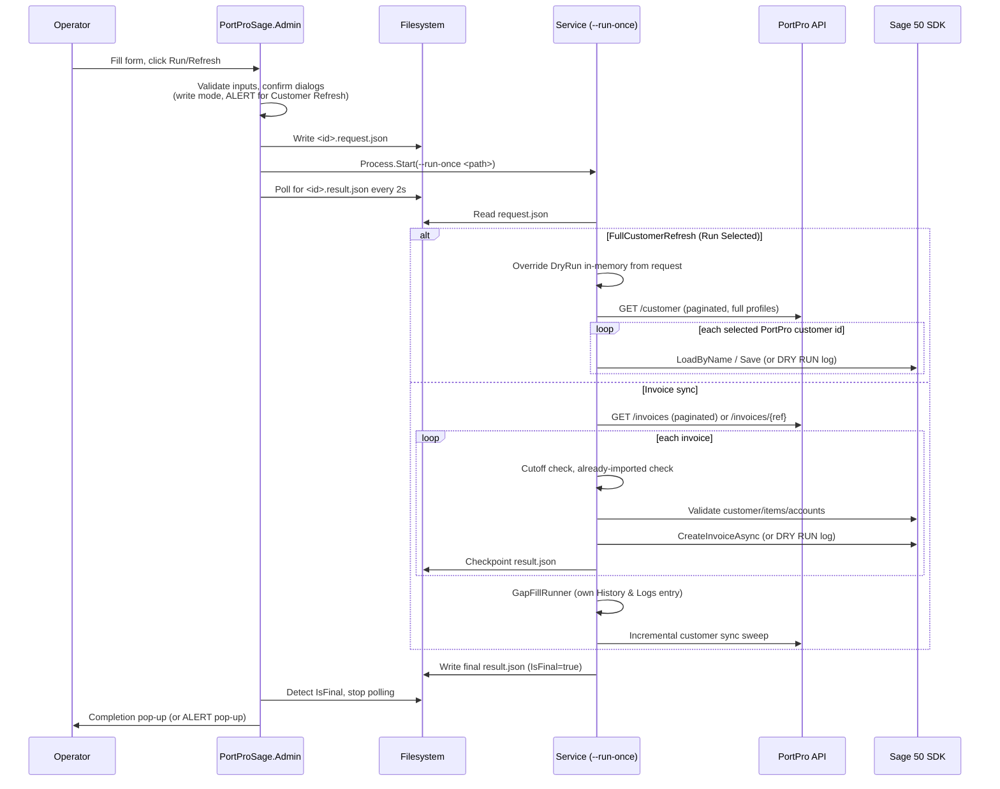
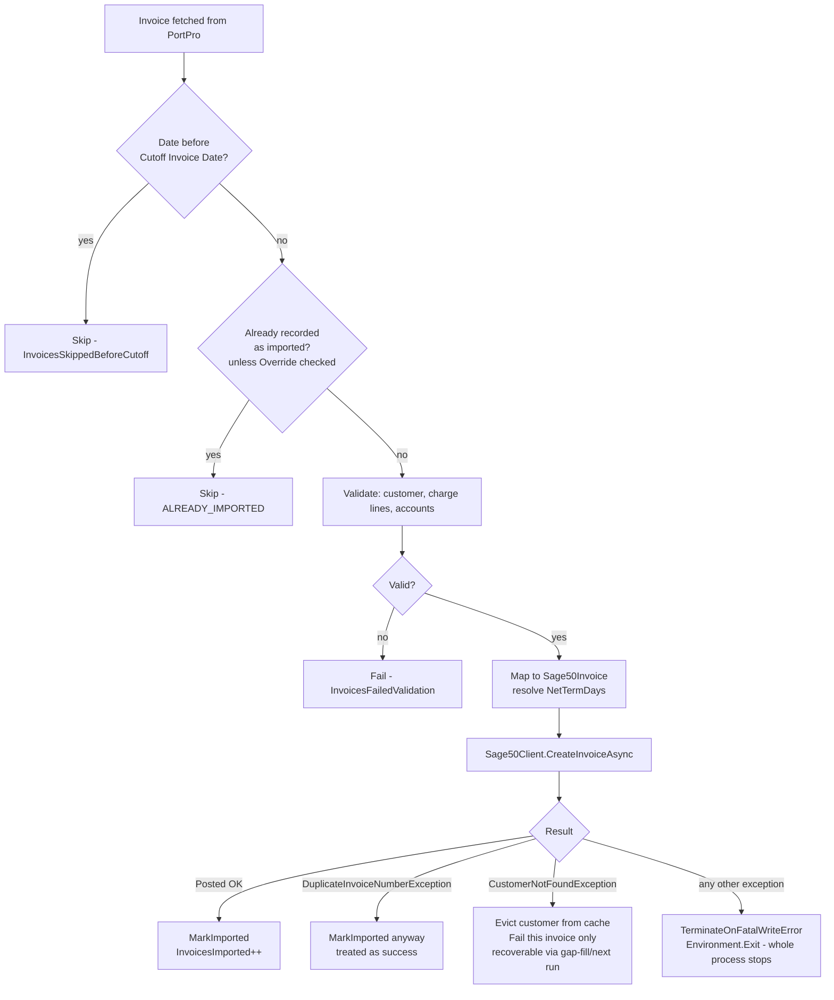
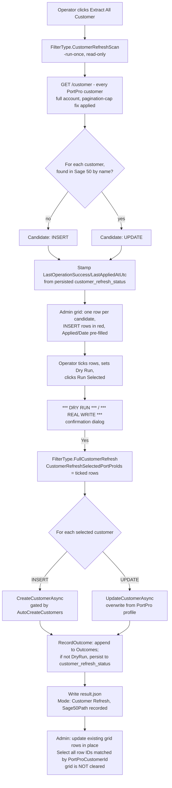
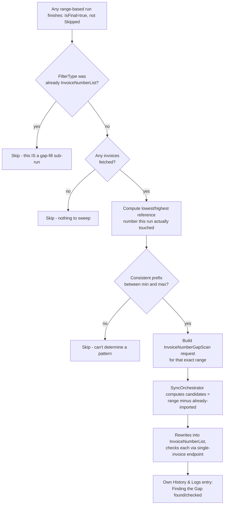

# PortProSage Sync — Technical Design Document

This is the engineering-level reference for PortProSage Sync: the environment it requires, the exact PortPro and Sage 50 APIs it calls, the business logic that decides what happens to each invoice and customer, and the process/data flow end to end. It assumes you already know what the app *does* for an operator — see `USER_GUIDE.md`/`USER_GUIDE.html` for that. This document is for whoever maintains, extends, redeploys, or troubleshoots the system at the code level.

> Quick-start / build-and-run instructions live in `README.md`. This document goes deeper: *why* the code is shaped the way it is, and the exact external contracts it depends on.

---

## Table of Contents

1. [System overview](#1-system-overview)
2. [Environment & prerequisites](#2-environment--prerequisites)
3. [Architecture](#3-architecture)
4. [PortPro API surface](#4-portpro-api-surface)
5. [Sage 50 SDK surface](#5-sage-50-sdk-surface)
6. [Core business logic](#6-core-business-logic)
7. [Process flows](#7-process-flows)
8. [Local data model (state.db)](#8-local-data-model-statedb)
9. [Configuration reference](#9-configuration-reference)
10. [Failure handling philosophy](#10-failure-handling-philosophy)
11. [Versioning & deployment](#11-versioning--deployment)
12. [Security & secrets](#12-security--secrets)
13. [Confirmed quirks & prior incidents](#13-confirmed-quirks--prior-incidents)

---

## 1. System overview

PortProSage Sync moves invoice and customer data one way: **PortPro (source of truth) → Sage 50 Canadian Edition (destination)**. It runs as a Windows Service that either polls PortPro on a schedule or executes a single explicit request, validates/maps each invoice against Sage 50's own master data (customers, items, GL accounts), and posts it via the Sage 50 SDK. A separate WinForms Admin application edits configuration and starts/stops/monitors runs — it never talks to PortPro or Sage 50 itself.

Nothing is ever pulled back out of Sage 50 into PortPro. The one exception that touches Sage 50 without an invoice attached is the customer-profile push (incremental sync or Customer Refresh) — still one-directional, PortPro → Sage 50.

---

## 2. Environment & prerequisites

| Requirement | Detail |
|---|---|
| **OS** | Windows Server (confirmed on Windows Server 2022 Standard) — must be a machine where Sage 50 Canadian Edition is installed and licensed, since the Sage 50 SDK is an in-process managed assembly, not a remote API. |
| **.NET runtimes** | `PortProSage.Core`, `PortProSage.Service`, `PortProSage.Trigger` target **.NET Framework 4.8** — required because the Sage 50 SDK assembly (`Sage_SA.SDK.dll`) is a .NET Framework component, and multi-user mode's connectivity check depends on `System.Runtime.Remoting`, which does not exist on .NET Core/.NET 5+. `PortProSage.Admin` targets **.NET 10.0-windows** — it never touches the SDK directly, so it isn't bound by that constraint. |
| **Sage 50 Canadian Edition** | A full, licensed, activated installation on the same machine, with the company file (`.SAI`) already created. The bundled SDK **must exactly match the installed Sage 50 product version** — Sage does not support a mismatched SDK, and two SDK versions cannot coexist. Check installed version via Sage 50 → Help → About; download the matching SDK from the Sage 50 Canadian Edition SDK Download Portal (`ca-kb.sage.com`). |
| **Sage 50 SDK files** | `lib/Sage50SDK/*.dll` (primarily `Sage_SA.SDK.dll`, plus its dependencies) bundled alongside the built Service/Trigger executables. `Sage50Client` logs the bundled SDK's file version at every connect, and warns (non-fatally) if `Sage50:ExpectedSdkVersion` is set and doesn't match. |
| **Sage 50 user account** | A **dedicated, non-interactive** Sage 50 user account (e.g. `PortProConnect`) — never an account a human also logs in with interactively. Sage 50 rejects a second simultaneous session under the same username, even in multi-user mode. |
| **Sage 50 multi-user mode** | The company file must be shared in multi-user mode so this service can connect (`openMultiUserMode: true`) while a human keeps a normal interactive session open under a different username. Single-user mode takes an exclusive lock for as long as this service's connection stays open (it's a long-lived DI singleton) — that would lock a human out of Sage 50 entirely for as long as the service runs. |
| **PortPro API access** | An Access Token + Refresh Token pair issued directly by PortPro (no OAuth client id/secret flow) — obtained from PortPro's own integration/API settings screen. Outbound HTTPS access to PortPro's API host (`https://api1.app.portpro.io`, confirmed in `appsettings.json`'s `PortPro:BaseUrl`). |
| **Local storage** | A writable folder for: the SQLite state database (`state.db`), rolling daily log files, the trigger/request folder tree (`requests/`, `requests/manual/`, `requests/auto-poll/`, `requests/processed/`), and failed-transaction CSV reports. All configurable via `Sync:*` settings; defaults live under `C:\PortProSageSync\`. |
| **Concurrency constraint** | Exactly **one** thing may hold a Sage 50 session at a time: the Automatic Service, a Manual Run, or a Customer Refresh. The Admin app enforces this by scanning for a running `PortProSage.Service.exe` process (any flavor) via WMI before starting a new one; the Worker's own automatic-poll cycle additionally checks for another `PortProSage.Service.exe` process before each cycle, in case one was started outside the Admin app. |
| **Email (optional)** | SMTP credentials for failed-transaction report emails — `PortProSage:Email:*`, disabled (`Enabled: false`) until configured. |

---

## 3. Architecture

| Project | Target | Role |
|---|---|---|
| `PortProSage.Core` | net48 | Shared library — PortPro HTTP client, Sage 50 SDK wrapper, validation/mapping, sync orchestration, local SQLite state, config models. Everything else references this. |
| `PortProSage.Service` | net48 | The actual executable. Runs three ways: (a) as an installed **Windows Service**, polling PortPro on a schedule and watching the trigger folder; (b) as a **one-shot process** via `--run-once <request.json>`, used by every Manual Run, Customer Refresh Extract, and Run Selected; (c) via **diagnostic CLI flags** (`--diagnose portpro`, `--diagnose sage50`, `--set-anchor`, etc.) for isolated troubleshooting. |
| `PortProSage.Trigger` | net48 | A small standalone CLI for dropping a request file into the trigger folder from outside the Admin app (e.g. a scheduled task on another machine with a mapped drive). Superseded for day-to-day use by the Admin app's Manual Run tab, which does the same thing directly. |
| `PortProSage.Admin` | net10.0-windows | WinForms configuration/control UI. Edits `appsettings.json`/`appsettings.Local.json` directly as files, and starts a run by either launching `PortProSage.Service.exe --run-once <path>` (Manual Run, Customer Refresh) or dropping a file for an already-running Service to notice. **Never** calls PortPro or the Sage 50 SDK itself — it duplicates just the JSON request/result *contract* (`PortProSage.Admin/Models/SyncContractModels.cs`) so it doesn't have to reference `PortProSage.Core` and drag in the net48/Sage 50 SDK dependency chain. |

### Why file-drop instead of a network/IPC API

The Admin app and the Service communicate purely through the filesystem: a `SyncRequest` is serialized to `<id>.request.json`, the Service (whichever process ends up handling it) processes it and writes `<id>.result.json` next to it, checkpointing after every invoice so a killed process still leaves a real partial result behind. This was chosen over a REST endpoint or named pipe on the Service because:

- The trigger tool needs zero network/IPC setup — just filesystem access to the same folder, which works unchanged from a scheduled task or a mapped drive on another machine.
- A result file surviving on disk after the writing process exits (crashed or not) is exactly what **History & Logs** is built to read — there's no separate "was this ever actually recorded" problem to solve.
- It naturally serializes access: only one process can plausibly be mid-write to Sage 50 at a time in practice, and every consumer (Admin's grid, the next poll cycle) just reads whatever's currently on disk.

### Component / deployment diagram



---

## 4. PortPro API surface

Base URL, endpoints, and every query parameter name below were confirmed **live**, not assumed — either by extracting string literals from the previously-working connector tool's compiled binary and testing them against the real API, or by direct `curl` calls against production using the real refresh token. Where a name looks like it doesn't quite match its semantic meaning (`billingFrom`/`billingTo` used for the "invoice date" filter, not literally "billing"), that's the confirmed real parameter name, not a guess.

### 4.1 Authentication

- PortPro issues an **Access Token + Refresh Token** pair directly (no client id/secret, no standard OAuth flow) via its own integration settings screen — configured once as `PortPro:AccessToken` / `PortPro:RefreshToken` (both secrets, kept out of `appsettings.json`).
- `POST {BaseUrl}{NewTokenEndpoint}` (`/generate-new-token`) mints a fresh access token from the refresh token. `PortProAuthService` calls this automatically whenever the cached token is judged expired, and also on-demand when a request comes back `401 Unauthorized` (`NotifyTokenRejectedAsync`), retrying that one request exactly once with the new token.
- Every outbound request carries `Authorization: Bearer {accessToken}`.
- `429 Too Many Requests` is retried with backoff (honoring a `Retry-After` header when PortPro sends one; exponential backoff up to 30s otherwise), up to 5 attempts — added after a large `InvoiceNumberList` run's rapid sequential single-invoice lookups triggered rate limiting that, unhandled, failed the *entire* run instead of just the one lookup.

### 4.2 Invoices — list endpoint

`GET {BaseUrl}{InvoiceEndpoint}` (`/invoices`), paginated via `skip`/`limit` (`limit` = `PortPro:PageSize`, default 100). Every page of every list call also sends `allInvoices=true`.

| Sync mode (`FilterType`) | Query parameters added | Notes |
|---|---|---|
| `LastChangedDate` | `updatedFrom` / `updatedTo` (ISO 8601) | PortPro's own "last touched" timestamp — can include an invoice dated well outside the window if it was merely edited. |
| `CompletedDateRange` (Admin's "Invoice date") | `billingFrom` / `billingTo` | The invoice's own real date — despite the parameter name, this is the closest analog PortPro exposes to "completed/invoice date." |
| `InvoiceNumberRange` | `billingFrom` / `billingTo`, deliberately widened to 10 years back → tomorrow | There is **no server-side reference-number filter** — confirmed no such parameter exists. A completely unbounded query was confirmed to make PortPro's API silently omit real, existing invoices (specifically ones spanning multiple charge sets/loads); a date-bounded query returns the complete, correct set. So this mode fetches broadly within a wide date bound and filters by `ReferenceNumber` **client-side**. |
| `InvoiceNumberList`, `InvoiceNumberGapScan` | *(does not use this endpoint at all)* | See §4.3. |

Response shape: `{ "data": [ { load fields..., "invoice": [ {charge-set fields...}, ... ] }, ... ] }`. One `data` entry is one PortPro *load*; its `invoice[]` array can hold more than one charge set for that load. `PortProClient.GetInvoicesAsync` flattens this so nothing downstream deals with the envelope, copying the load-level `id`/`createdAt`/`updatedAt`/`paymentTerms`/`paymentTermsMethod` onto each flattened invoice.

An unrecognized/unhandled `FilterType` reaching `BuildQueryString`'s `default` case **throws immediately** rather than silently sending no filter at all — this is a deliberate fail-loud guard (§13) after a version-skew incident where an older Service build, given a request written by a newer Admin build using a `FilterType` it didn't know, fell through with no filter and began really importing the entire production account.

### 4.3 Invoices — single-invoice endpoint

`GET {BaseUrl}{InvoiceEndpoint}/{referenceNumber}` — looks up one invoice directly by reference number, bypassing pagination entirely. Confirmed to find at least one real, existing invoice that the list endpoint could not return under *any* query tried (unfiltered or date-bounded). Used for:

- `FilterType.InvoiceNumberList` — an explicit, comma-separated set of reference numbers, each fetched one at a time with a 150ms pause between calls (rate-limit avoidance). A reference number that comes back 404 is logged and skipped, not treated as fatal.
- `FilterType.InvoiceNumberGapScan` — see §6.9; internally rewrites itself into `InvoiceNumberList` and goes through the exact same code path.
- The `--check-invoice` diagnostic CLI flag.

This endpoint wraps its response differently than the list endpoint (`{"data": {load fields..., "invoice": [charge sets...]}}`) and one reference number can legitimately span multiple charge sets that need combining, not treating as duplicates — `ConsolidateChargeSets` sums amounts and concatenates pricing lines across them, taking scalar fields (status, dates, caller) from the first.

### 4.4 Customers

Confirmed live to be a **separate, richer object** from the lightweight `caller` embedded on each invoice (`_id`, `company_name`, `currency`, `externalSystemID` only):

- `GET {BaseUrl}{CustomerEndpoint}/{id}` (`/customer/{id}`) — one customer's full profile, ~94 fields. `id` is the same value available as `invoice.caller._id`.
- `GET {BaseUrl}{CustomerEndpoint}` (`/customer`), paginated `skip`/`limit` — the **entire** list, returning the exact same full-profile shape as the single fetch (confirmed live), so a full account scan (~223 customers on this account) needs no per-customer detail call at all.
  - **Confirmed live 2026-08-23: this endpoint silently caps every response at 50 records, ignoring the requested `limit`** — direct PowerShell `Invoke-RestMethod` calls with `limit=100` each returned exactly 50 records regardless of `skip` (0/50/100 all returned 50). `/invoices` correctly honors `limit=100`; this is specific to `/customer`. `PortProClient.GetAllCustomersAsync`'s original pagination-termination check (`body.Data.Count < _settings.PageSize` ⇒ "last page", advancing `skip` by the requested page size) silently truncated a full-account scan to the first 50 customers on the very first page. **Fixed** by advancing `skip` by the *actually-returned* count and only stopping on a genuinely empty page — confirmed against this account's real 223 customers.

Fields actually consumed (see `BuildSage50Profile`, §6.6):

| PortPro field | Meaning | Mapped to |
|---|---|---|
| `company_name` | Legal/display name | Sage 50 `Name` (also the match key — see §6.6) |
| `currency` | Customer's currency, sometimes blank | Sage 50 `CurrencyCode` (left at Sage 50's default if blank) |
| `main_contact_name` | Primary contact | Sage 50 `Contact` |
| `address1` | Street address | Sage 50 `Street1` |
| `city` | City | Sage 50 `City` |
| `state` | Province | Sage 50 `Province` |
| `country` | Country | Sage 50 `Country` |
| `zip_code` | Postal code | Sage 50 `PostalCode` |
| `mobile` | Phone | Sage 50 `Phone1` |
| `billingEmail` | The **real**, human-entered billing email | Sage 50 `Email` |
| `email` | A PortPro-**generated proxy** address — deliberately **never** used | *(not mapped)* |
| `updatedAt` | Last-changed timestamp | Compared against `customer_sync_state` to detect a real change |
| `defaultPaymentTerms.{paymentTermsMethod, days}` | Customer-level default terms | *(not currently mapped — see §6.8; per-invoice terms are used instead)* |
| `secondary_contact_name`, `secondaryPhoneNo` | Alternate contact | *(not currently mapped)* |

### 4.5 Per-invoice payment terms

Confirmed present on the invoice **envelope** (sibling to `_id`/`invoice`/`createdAt`, same level as the load), not the customer object — genuinely varies per invoice, not a constant repeated from the customer:

- `payment_terms` (flattened onto `PortProInvoice.PaymentTermsNetDays`)
- `payment_terms_method` (flattened onto `PortProInvoice.PaymentTermsMethod`)
- `invoiceDueDate` (present but not currently consumed — the *days* value plus Sage 50's own `SetTermDiscNetDay` is used instead of a precomputed due date, so Sage 50 computes it consistently with its own invoice date)

### 4.6 Known API-shape gotchas

- **Pagination instability against a live dataset.** A gap-fill sweep re-fetching the exact same reference-number range a prior run just fetched can occasionally still find "missing" invoices — confirmed via direct replicated `curl` calls that this is records shifting between sequential `skip`/`limit` calls against live, mutating data, not a systemic list-endpoint omission. This is *why* the gap-fill mechanism exists as a permanent safety net (§6.9) rather than a one-time fix.
- **Multi-charge-set invoices can be invisible to the list endpoint.** At least one confirmed real case (2 charge sets from 2 different loads sharing one reference number) never appeared via the list endpoint under any query, while a single-charge-set neighbor did. The single-invoice endpoint found it fine.

---

## 5. Sage 50 SDK surface

**This is a managed .NET assembly (`SimplySDK` namespace, ships as `Sage_SA.SDK.dll`), not a COM component** — there is no ProgID to resolve; it's referenced and called directly, confirmed against the SDK's own shipped XML documentation and cross-checked with real reflection over the shipped assembly plus live calls against a real company file.

### 5.1 Connection model

```
SDKInstanceManager.Instance                       // process-wide singleton
    .SetAlertImplementation(HeadlessSdkAlert)      // MUST be set before OpenDatabase - the default
                                                    // implementation throws on every alert, including
                                                    // ordinary Yes/No confirmations a human would click through
    .OpenDatabase(companyPath, userName, password,
                  openMultiUserMode: true,
                  appName, appId, 1)                // appId ("TPAppCode") max 6 characters
    .OpenCustomerLedger() / OpenInventoryLedger() / OpenAccountLedger()   // opened once, reused for the
                                                                          // connection's lifetime (see below)
    .OpenSalesJournal()                             // opened fresh per invoice, closed in a finally block
    .CloseDatabase()                                // on Dispose
```

`Sage50Client` is a DI singleton with a `_connected` flag — `ConnectAsync` is idempotent after the first real connect within a process's lifetime. The three long-lived ledgers (`CustomerLedger`, `InventoryLedger`, `AccountLedger`) are opened once and reused for every subsequent lookup/create, **not** reopened per call — confirmed live that opening/closing a ledger has real, measurable overhead, and a 120-invoice run was doing this several times *per invoice*. `SalesJournal` (the actual invoice-posting object) is deliberately **not** pooled the same way — it's opened fresh and closed in a `finally` block for every single invoice, since this file has real incident history (§13) of a failed write leaving an SDK session in a bad state, and the SDK's own docs don't document a "reset for reuse" method on it anyway.

### 5.2 Objects and methods actually used

| Object | Purpose | Key methods/properties used |
|---|---|---|
| `ReceivableModule.CustomerLedger` (`: APARLedgerBase : LedgerBase`) | Customer master data | `LoadByName(string)`, `InitializeNew()`, `Save()`; settable string properties: `Name`, `Contact`, `Street1`, `Street2`, `City`, `Province`, `Country`, `PostalCode`, `Phone1`, `Phone2`, `Fax`, `Email`, `WebSite`, `CurrencyCode` |
| `InventoryModule.InventoryLedger` | Service items | `LoadByPartCode(string)`, `InitializeNew()`, `Save()`; `Number`, `Name`, `IsServiceType`, `RevenueAccount` |
| `GeneralModule.AccountLedger` | GL account existence check | `LoadByAccountNumber(int)` (preferred — confirmed `LoadByAccountDisplayString` returns `false` for every real account tried, so it is not used for numeric lookups) |
| `Support.SalesJournal` / `InvoiceJournal` | Posts the actual sales invoice | `SelectTransType((short)0)` (**must be called first** — 0=Invoice, 1=Order, 2=Quote; the combined journal otherwise defaults to a mode where invoice-specific setters throw); `SelectAPARLedger(customerName)` (returns the selected customer's numeric id, or ≤0 if the name didn't resolve — **not** auto-checked by the SDK, must be checked by the caller); `InvoiceNumber` (settable string — the real Sage 50 invoice number, set directly to PortPro's reference number for traceability; **not** `SetReferenceNumber`, which is documented as "the reference number for the prepayment or deposit," an unrelated field); `SetJournalDate(string)`; `SetTermDiscNetDay(int)` (the actual "Net N days" due-date field); `SetItemNumber`/`SetDescription`/`SetQuantity`/`SetPrice`/`SetLineAccount`/`SetTaxCodeString` (per line, 1-indexed); `Post()` (returns `bool`) |

### 5.3 Confirmed limitations (not guesses — verified via live reflection over the shipped assembly)

- **No per-customer receivable/AR account property exists at all.** Simply Accounting/Sage 50 posts every customer to one global AR control account, configured once in Sage 50 itself (Setup ▸ Settings ▸ Customers & Sales ▸ Linked Accounts) — not something this integration can set per customer, regardless of `Sage50:DefaultReceivableAccount`'s configured value (kept only for audit/logging; documented as having no functional effect).
- **No per-customer payment-terms property exists either.** Terms live only on the invoice-posting object (`SetTermDiscNetDay`), not the customer master record — meaning Sage 50 does not remember "this customer is always Net 30" the way it might display on-screen; it must be set explicitly on every single invoice, which is exactly what the due-date fix (§6.8) does.
- **`SelectAPARLedger` does not auto-populate payment terms** from whatever the customer's Sage 50 record might show on-screen — the SDK's own docs only mention auto-defaulting the paid type there.
- **Re-reading `InvoiceNumber` after `Post()` is unreliable** — confirmed live it returns a value unrelated to what was actually saved. The code returns the value it *set* before `Post()`, not what it reads back afterward.
- **Any unhandled exception from a real (non-Dry-Run) write is treated as evidence of a possibly-compromised SDK session** and terminates the whole process — see §10.

---

## 6. Core business logic

### 6.1 Sync modes (`FilterType`)

| Mode | Selects by | Notes |
|---|---|---|
| `LastChangedDate` | PortPro `updatedAt` window, or the persisted watermark when `UseWatermark=true` ("Continue") | Automatic polling always uses `UseWatermark=true`. |
| `CompletedDateRange` | Invoice's own billing date window | Admin UI labels this "Invoice date" — the safe default; can't pull in something merely *edited* outside the window. |
| `InvoiceNumberRange` | Reference number between Start/End (both inclusive) | Client-side filtered within a wide date-bounded fetch — see §4.2. |
| `InvoiceNumberList` | An explicit, comma-separated set | One-at-a-time single-invoice lookups. |
| `InvoiceNumberGapScan` | *(internal only — never chosen by hand)* | Computes its own `InvoiceNumberList` candidate set (a range minus everything already recorded as imported), then rewrites itself into `InvoiceNumberList` and proceeds through that exact path. Driven by `GapFillRunner`, §6.9. |
| `FullCustomerRefresh` | *(no invoices at all)* | Entirely separate code path — see §6.10. Every `Invoices*` field on the resulting `SyncResult` is repurposed to carry customer counts instead. |

### 6.2 Watermark / "Continue"

A persisted `(date, last-processed-invoice-number)` pair in `state.db`'s `watermark` table. A `UseWatermark=true` request resolves `From` from the saved date and `To` as "now" inside `SyncOrchestrator.RunAsync`; only a watermark-driven run advances this state afterward. Any other mode is a one-time override that never reads or writes it — confirmed by design: `WatermarkBeforeRun`/`WatermarkAfterRun` are captured on every run (not just watermark-driven ones) specifically so an explicit-range run can be shown side by side proving it left the persisted state untouched.

### 6.3 Cutoff (lower) invoice date

`Sync:CutoffInvoiceDate` — a hard floor applied identically regardless of mode: an invoice whose own date (billing date, falling back to completed date) is before this is skipped outright (`InvoicesSkippedBeforeCutoff`), never even attempted against Sage 50. Exists to stop Sage 50's own "Do Not Allow Transactions Dated Before…" configuration from rejecting an invoice mid-run and (before this existed) potentially cascading into the fatal-write-error path.

### 6.4 Max invoices / max customers cap

`SyncRequest.MaxInvoicesToProcess` — enforced **inside the same run's own loop**, not by pre-computing a boundary and handing it to a separately-refetched run (confirmed live that approach doesn't reliably cap anything against PortPro's live, mutating data). Counts only **genuinely processed** items — for invoices, `InvoicesImported + InvoicesFailedValidation + InvoicesFailedImport` (an already-imported invoice that's merely skipped does not count); for `FullCustomerRefresh`, the same field is repurposed as "max customers to actually **update**" (a customer not found in Sage 50, and therefore skipped, does not count).

### 6.5 Dry Run semantics — two independent flags

| Flag | Config key | Scope |
|---|---|---|
| Shared Dry Run | `Sage50:DryRun` (persisted in `appsettings.Local.json`) | Every ordinary Manual Run, the Automatic Service, and the periodic customer-sync sweep. Shown/editable identically on the Manual Run tab and the Sage 50 tab — the exact same setting, saved immediately either place. |
| Customer Refresh's own Dry Run | `SyncRequest.CustomerRefreshDryRun` — **never persisted**, defaults to `false` on every use | Applies **only** to that one Run Selected execution. `Diagnostics.RunFullCustomerRefreshAsync` overrides `Sage50Settings.DryRun` **in-memory, for that one dedicated process only** (the same technique already used by the `--real-transfer`/`--create-test-item` diagnostic commands to force Dry Run off for a single bounded operation) — it never touches `appsettings.Local.json`, and since that process only ever performs this one operation and exits, there's no later run in the same process for the override to leak into. |

When either flag is set, every Sage 50 *write* call (`CreateCustomerAsync`, `UpdateCustomerAsync`, `CreateServiceItemAsync`, `CreateInvoiceAsync`) short-circuits to a log line describing what it *would* do and returns a synthetic result (a `DRYRUN-` prefixed invoice number) without calling the SDK at all. `SyncStateRepository.MarkImported`/`MarkCustomerSynced`/`RecordCustomerRefreshOutcome` are all guarded against recording a Dry Run result as if it were real — otherwise turning Dry Run off later would make those items look "already done" forever. Confirmed 2026-08-24: `CustomerRefreshDryRun` now **defaults to `false`** on every `SyncRequest` (the Admin UI's own checkbox also defaults unchecked, reversing the old "defaults to checked" behavior) — a real write is the default action for Run Selected, not a simulation.

### 6.6 Customer resolution, auto-create, and per-run caching

`InvoiceValidationService.ValidateCustomerAsync`, invoked once per invoice:

1. Match key is `invoice.Caller.CompanyName` (falling back to `invoice.CallerName`) — matched against Sage 50 by **name only** (`CustomerLedger.LoadByName`); there is no separate "customer code" concept in this SDK.
2. **Per-run cache first** (`_resolvedCustomerCodeByNameThisRun`, keyed case-insensitively) — a customer already found-or-created earlier in *this same run* is never re-checked. `InvoiceValidationService` is a DI singleton reused across every poll cycle of a long-running Service, so this cache is explicitly cleared (`ResetPerRunCache`) at the very top of every `SyncOrchestrator.RunAsync` call — not just once at process startup.
3. Cache miss → `FindCustomerByNameAsync`. Found → cached and used.
4. Not found → if `Sage50:AutoCreateCustomers` is off, validation fails outright. If on: fetch PortPro's **full** customer profile via `GET /customer/{id}` (§4.4) when the invoice's `caller.id` is available (falling back to name + invoice-level currency only if the id is missing or the fetch itself fails — a profile-fetch problem never blocks customer/invoice creation). Build a `Sage50CustomerProfile` (`BuildSage50Profile`, shared with the customer-sync path so a customer looks identical whether it was just auto-created or refreshed later) and create it, then cache the result and record it in `customer_sync_state` so the next incremental sync sweep doesn't immediately consider it "changed."

**Mid-run deletion recovery.** Because the cache can span a run lasting hours, a customer cached as "found" earlier can genuinely be deleted or renamed in Sage 50 *during* that same run. `Sage50Client.CreateInvoiceAsync`'s `SelectAPARLedger` call independently re-validates the customer immediately before posting — if it no longer resolves, it throws `CustomerNotFoundException` (a **recoverable** exception, since nothing was written yet — `SelectAPARLedger` is a pure selection call, not a write). `SyncOrchestrator.ProcessOneInvoiceAsync` catches this specifically (not the generic Sage 50 fatal-write path), evicts the stale name from the per-run cache (`InvalidateCustomer`), and fails just that one invoice cleanly. Any **later** invoice for the same customer in the same run gets a fresh lookup — a real chance to auto-recreate the customer and succeed immediately, rather than only via a later gap-fill/Continue run. The one invoice that hit the stale cache is left genuinely unposted/unmarked, picked up by the automatic gap-fill sweep that runs after every range-based run, or the next Continue run.

### 6.7 Item/GL account resolution

Each PortPro charge line (`pricing[]`) is matched to a Sage 50 service item by code/description (`InventoryLedger.LoadByPartCode`); missing ones are auto-created (`Sage50:AutoCreateItems`) using either a configured `ChargeAccountMap` entry's `Sage50AccountNumber`, or `Sage50:DefaultRevenueAccount` as fallback. Resolution order, confirmed and documented directly in `InvoiceValidationService`: **charge-specific mapping → default revenue account → hard error** (the whole invoice fails rather than posting to an undefined account). PortPro's own `glCode` on a charge is reference/audit only and never used to resolve the actual posting account. Whichever account is finally chosen is confirmed to actually exist (`AccountExistsAsync`) before the invoice is imported — `LoadByAccountNumber`, not `LoadByAccountDisplayString` (confirmed the latter returns `false` for every real account tried). A small `AccountsUnverifiableBySdk` allow-list exists for accounts confirmed real but which the SDK itself can't verify (e.g. certain currency-paired accounts) — this bypasses the SDK check for exactly those account numbers, never as a general escape hatch.

### 6.8 Due date / payment terms

Every invoice used to post with an implicit Net 0 (`SetTermDiscNetDay` was never called at all before this fix), so Sage 50 always showed Due Date = Invoice Date regardless of the customer's real terms. `SyncOrchestrator.ResolveNetTermDays` now resolves the number of days from **PortPro's own per-invoice `payment_terms`/`payment_terms_method` fields** (§4.5, confirmed genuinely per-invoice, not a constant) when present and in units of days, falling back to `Sage50:DefaultNetTermDays` (default 30) with a warning log otherwise. `MapToSage50Invoice` sets `Sage50Invoice.NetTermDays` from this; `Sage50Client.CreateInvoiceAsync` calls `journal.SetTermDiscNetDay(invoice.NetTermDays)` before posting. The resolved due date (`InvoiceDate + NetTermDays`) is recorded on the outcome (`Sage50DueDate`) and surfaced in the "Invoice Transferred" log line/grid column.

### 6.9 Gap-fill ("Finding the Gap")

Not a mode an operator picks — an automatic follow-up run, triggered by `GapFillRunner.RunIfApplicableAsync` after **every** completed, range-based run (Manual Run, an automatic poll cycle, or a trigger-file request), regardless of source. After the original run finishes cleanly, it computes `[lowest, highest]` reference number that run actually touched, and re-runs exactly that range through the `InvoiceNumberGapScan` → `InvoiceNumberList` path — checking each candidate individually via the single-invoice endpoint, which is confirmed more reliable than the list endpoint for multi-charge-set invoices (§4.6). Recorded as its own separate History & Logs entry ("Finding the Gap (found/checked)"). Skipped if the original run didn't complete cleanly, fetched nothing, or is itself already a gap-fill sub-run (no recursion). Remains necessary as a permanent safety net even with `allInvoices=true` sent on every query, since the residual symptom is pagination instability against a live-mutating dataset (§4.6), not a fixable client-side omission.

**Per-candidate not-found outcomes** (added 2026-08-24): `PortProFetchResult.NotFoundReferenceNumbers` (populated by `PortProClient.GetInvoiceListByReferenceNumbersAsync`, §4.3) carries the actual reference numbers behind `NotFoundCount`, not just the bare count. `SyncOrchestrator.RunAsync`'s batch loop adds one `InvoiceProcessingOutcome` (`Success = false`) per not-found candidate, worded differently depending on origin — captured via `isGapFillSweep = request.FilterType == FilterType.InvoiceNumberGapScan`, read **before** the gap-scan rewrite (§6.1) overwrites `FilterType` to `InvoiceNumberList`, since that's the only point where the two are still distinguishable:
- Gap-fill sweep: `"{ref} (Invoice from identified GAP, not found in PortPro)"`.
- An operator-typed Invoice number list: `"{ref} (not found in PortPro)"`.

These show up as their own rows in History & Logs' "Validate Invoice Extracted" grid, `Success = No`, with the message as the reason — previously only the aggregate `InvoicesNotFound` count existed, with no way to see which specific candidates those were.

### 6.10 Customer sync — incremental sweep vs. Customer Refresh tab

`CustomerSyncService` exposes three separate public entry points (no longer one shared `forceAll`/`maxCustomers`-parameterized method):

- **`SyncChangedCustomersAsync`** — runs once per Automatic Service cycle and once per Manual Run (after gap-fill). Gated by `Sage50:SyncCustomerUpdatesFromPortPro` (default on). For each PortPro customer with a non-blank company name and a real `updatedAt`, compares it against `customer_sync_state`'s last-synced value; unchanged customers are skipped before any Sage 50 lookup at all. A changed customer that resolves in Sage 50 gets `UpdateCustomerAsync` (same `ApplyProfile`/`BuildSage50Profile` mapping as auto-create, §6.6); one that doesn't is simply marked synced anyway (so the same "changed but not in Sage 50 yet" customer isn't re-checked every sweep) — this method **never creates** a customer.
- **`ScanForRefreshAsync`** (`FilterType.CustomerRefreshScan`, the Admin app's **Customer Refresh** tab, "Extract All Customer") — a **read-only** comparison, not a write. Fetches every PortPro customer (§4.4, now genuinely the full account since the pagination-cap fix) and checks each by name against Sage 50, classifying it `INSERT` (no match) or `UPDATE` (match found) without touching Sage 50 at all. Bypasses the changed-since-last-sync check entirely — every customer is compared every time, unconditionally. Also loads `_state.GetAllCustomerRefreshOutcomes()` once up front and stamps each `CustomerRefreshCandidate.LastOperationSuccess`/`LastAppliedAtUtc` from the persisted `customer_refresh_status` table (§8), so the Admin grid can pre-fill Applied/Date columns from a previous session's real run without needing to re-run anything.
- **`ExecuteSelectedRefreshAsync`** (`FilterType.FullCustomerRefresh`) — the actual write step ("Run Selected"), scoped to exactly the PortPro customer IDs the operator checked in the grid (`SyncRequest.CustomerRefreshSelectedPortProIds`), not "every customer" — a deliberate change from the old design, which refreshed the whole account unconditionally with an optional cap. No `maxCustomers` cap exists here; the selected-IDs list *is* the scope. For each selected customer: `INSERT` creates it in Sage 50 (gated by `Sage50:AutoCreateCustomers`, same as invoice-time auto-create), `UPDATE` overwrites the existing Sage 50 record from PortPro's current profile. A local `RecordOutcome(operation, success, message)` closure appends every result to `CustomerRefreshResult.Outcomes` (threaded back to the Admin app so it can update grid rows in place instead of clearing them) and — **guarded by `if (!_settings.DryRun)`** — calls `_state.RecordCustomerRefreshOutcome(...)`, persisting to `customer_refresh_status` (§8). A Dry Run's outcome is therefore visible in that run's own result/grid update, but never becomes part of the persisted "last real outcome" history.

Both `SyncChangedCustomersAsync` and `ExecuteSelectedRefreshAsync` still update `customer_sync_state` on a successful non-Dry-Run write, so a real Customer Refresh Run Selected also resets the incremental sweep's "last synced" watermark for every customer it touches.

### 6.11 History & Logs / audit trail

Every run — automatic poll cycle, Manual Run, trigger-file request, or Customer Refresh — produces a `SyncRequest`/`SyncResult` JSON pair on disk (checkpointed live, not just at the end), reconstructed into the History & Logs grid by `RunHistoryService.ListRuns` from four sources: the processed-trigger archive, the live trigger folder (pending), the Manual Run subfolder, and the auto-poll subfolder — plus a log-line-reconstruction fallback for entries that predate one of these folders existing at all. Deleting a run (`RunDeletionService`) removes its request/result files, any failed-transaction CSV it produced, and its rows in `imported_invoice` **scoped to that run's own `Sage50Path`** (§6.12 — grouped per distinct path across a multi-run batch delete, since a reference number is only unique *within* one path now, not globally), and records the deletion permanently in a `deleted-history-ids.json` exclusion list so it can never silently reappear via the log-reconstruction fallback.

### 6.12 Per-Sage50-path scoping

**Problem confirmed live 2026-08-10 and again 2026-08-23**: before this feature, every table in `state.db` was a single flat, unscoped bucket — switching `Sage50:CompanyDataPath` between two different `.SAI` files (e.g. a DEV company file and the real PROD one) meant an invoice tracked as "already imported" while pointed at one file was silently treated as already-imported when later pointed at a completely different one, even though the second file never actually received it (documented at the time as the reason the Settings tab's "Clear All Imported-Invoice Records" manual workaround exists at all). The same cross-contamination applied to the watermark, `customer_sync_state`, and (once it existed) `customer_refresh_status`.

**Fix**: every state-carrying table now includes a `sage50_path TEXT NOT NULL COLLATE NOCASE` column as part of a composite primary key, and every read/write in `SyncStateRepository` is scoped by a `CurrentSage50Path` property (`Sage50Settings.CompanyDataPath`, injected via DI — `Sage50Settings` is already a registered singleton in `Program.cs`, so this required no new wiring beyond adding it as a constructor parameter). `COLLATE NOCASE` avoids needing to manually normalize path casing (Windows paths are case-insensitive) while keeping the *displayed* value's original casing intact for the path-picker dropdowns.

**Schema migration** (`SyncStateRepository.Initialize`, `MigrateTableForSage50Path` local function): SQLite can't `ALTER TABLE` a primary key, so each table is migrated via `PRAGMA table_info` (detects whether `sage50_path` is already present) → if not: rename the existing table → create it fresh with the new schema → copy every row across, backfilling `sage50_path` with whichever path is *currently* configured at the moment the migration runs → drop the renamed-aside old table, all inside one transaction. This is a **one-time, best-effort backfill, not a true historical reconstruction** — a table that predates this feature has no record of which path was actually active when each of its rows was written, so every pre-existing row is stamped with "whatever's configured right now," which is only correct if that happens to be the path that was actually in use for most/all of that history. **Confirmed as a real, non-hypothetical gap 2026-08-23**: cross-referencing `imported_invoice`'s `imported_at_utc` timestamps against the Service's own historical `logs/*.log` "Sage50 company file: …" startup lines showed all 3,664 pre-existing rows were genuinely created while pointed at one path, while the migration (which ran later, after the configured path had since changed) had backfilled them to a *different* one — corrected by hand via a one-off, precisely-timestamp-matched `UPDATE` once identified, not by any code path (there is no in-app "re-key path" tool). A future occurrence of the same gap is only preventable by not changing `CompanyDataPath` while unmigrated legacy data still exists, which by now it does not.

**`GetAllKnownSage50Paths()`** — unions distinct `sage50_path` across all four tables; backs both Admin-side path-picker dropdowns via a parallel, Admin-side-only `Sage50PathStateService` (`PortProSage.Admin/Services/`), which reads `state.db` directly with its own `Microsoft.Data.Sqlite` connection rather than going through the Service process — the same "Admin can't reference Core" constraint (§3) that already applies to `ImportedInvoiceStateService`.

**Admin UI behavior** (Customer Refresh and History & Logs, mirrored identically): the path dropdown always includes the currently-configured path (added if `GetAllKnownSage50Paths()` doesn't yet have it) but **never overrides an operator's existing selection** — it only defaults to the current path the first time a tab is ever visited in a session, **unless the actively-configured path has genuinely just changed** (a real Save on the Sage 50 tab, detected by `RefreshGlobalTargetSage50Label`'s own before/after comparison — see §6.13), in which case both dropdowns are force-reset to follow the new path; a stale selection made against the OLD path being silently preserved forever was confirmed live 2026-08-24 to read as broken, not deliberate. Refreshed both on full config reload (`RefreshAllTabsFromConfig`) and on every tab click (`_tabs.SelectedIndexChanged`), so a path just saved on the Sage 50 tab shows up the moment the operator actually looks at either tab, without requiring a full app restart. Selecting the current path keeps Customer Refresh fully live (Extract/Run Selected enabled); selecting any other path switches it to a read-only view of that path's persisted `customer_refresh_status` rows, since a live PortPro-vs-Sage50 comparison is only meaningful against whichever company file is actually connected. History & Logs' path filter (`MatchesHistoryPathFilter`) is purely a display filter — an entry with `Result.Sage50Path == null` (recorded before this feature existed, or written by a Service binary built before the field was added — see §13 item 13) **always shows regardless of the selected filter**, so older history is never silently hidden by a feature it predates.

### 6.13 Per-path Sage 50 tab configuration snapshots

Confirmed live 2026-08-24: `appsettings.json`/`appsettings.Local.json` hold exactly **one** current Sage 50 configuration (App name/ID, username/password, account defaults, tax codes, charge account map — everything on the Sage 50 tab except the path itself), overwritten in place on every Save regardless of which company-file path it was actually for. Switching between two paths (e.g. DEV vs PROD) used to mean re-entering all of that by hand every time, since only the path itself was ever remembered per-path (§6.12) — none of the rest of the tab was.

**Fix**: `Sage50ConfigSnapshotService` (`PortProSage.Admin/Services/`, Admin-only — the Service never reads this) adds a small, separate `admin_sage50_config_snapshot` table to `state.db` (`sage50_path TEXT PRIMARY KEY COLLATE NOCASE`, `config_json`, `saved_at_utc`), storing the entire Sage 50 tab (serialized as one JSON blob) keyed by path, upserted (`INSERT ... ON CONFLICT DO UPDATE`) every time "Save Sage 50 settings" runs (and, since Test Connection now saves silently first — see the User Guide — every time that runs too). Picking a **different** path from the Company data path dropdown (a genuine operator selection, not typing a new path — same `SelectedIndexChanged` unsubscribe/resubscribe guard already used for the path-picker dropdowns) loads that path's own last-saved snapshot and repopulates every other field on the tab from it; a path with no snapshot yet (never saved through this app) just leaves the other fields as they are.

The Company data path field itself is an editable `ComboBox` (`DropDownStyle.DropDown`, not `DropDownList`) — free typing still works, with a **Browse...** button (`OpenFileDialog`, filtered to `*.SAI`) next to Test Connection for picking a company file directly off disk. Its dropdown list is the union of two sources: `LoadPreviousSage50Paths()` (an Admin-only history in `admin-settings.json`'s `PreviousSage50Paths` array, appended to on every Save, most-recent-first, capped at 10) and `Sage50PathStateService.GetAllKnownPaths()` (§6.12's state.db-derived list) — confirmed live 2026-08-24 that relying on just the first source alone left a genuinely-used path missing if it predated this feature or was only ever configured by hand-editing `appsettings.Local.json`.

**Global banner immediacy**: `RefreshGlobalTargetSage50Label` (top bar's "Target Sage50:" label) used to only refresh on a full config reload (Service folder Browse/Reload), so it could show a stale path indefinitely after a genuine Sage 50 tab Save. Now called explicitly after every `SaveSage50Tab()` (and therefore after Test Connection too), and on every tab switch (`_tabs.SelectedIndexChanged`) as a catch-all safety net. It also tracks the last path it showed (`_lastKnownTargetSage50Path`) — a genuine change (not the first-ever call) triggers `forceFollowCurrent` on both Customer Refresh's and History & Logs' path dropdowns (see above). Separately, selecting a path from the Company data path dropdown (`OnSage50PathSelected`) updates this same banner **immediately**, optimistically showing the just-picked (possibly still-unsaved) path — a deliberate, narrow exception to the "only ever show the SAVED path" rule, safe specifically because every confirmation dialog that actually starts a run (Manual Run, Automatic Service start, Customer Refresh Run Selected) reads the saved path directly via `CurrentConfiguredSage50Path`, never this banner — see §13 item 15 for the incident this rule exists to prevent.

### 6.14 Per-outcome customer detail

Added 2026-08-24 to `InvoiceProcessingOutcome` (Core) / its Admin JSON-contract mirror, populated in `SyncOrchestrator.ProcessOneInvoiceAsync`:

- **`PortProCustomerName`** — `invoice.Caller?.CompanyName ?? invoice.CallerName`, shown as the leading "PortPro Customer Name" column on both History & Logs' "Validate Invoice Extracted" and "Invoice Transferred" grids.
- **`CustomerAutoCreated`** — copied from the new `ValidationResult.CustomerAutoCreated` (set `true` only by `InvoiceValidationService.ValidateCustomerAsync`'s own `CreateCustomerAsync` call, never for a cache hit or an existing Sage 50 match — so a later invoice for the same, now-cached customer doesn't double-count it). `SyncOrchestrator.RunAsync`'s loop increments `SyncResult.CustomersCreated` from this per invoice.
- **`Sage50CustomerAction`** — `"CREATED"` when `CustomerAutoCreated`; `"UPDATED"` when the customer already existed **and** `Sage50Settings.SyncCustomerUpdatesFromPortPro` is on (meaning it's kept in sync by the trailing incremental sweep, §6.10 — not necessarily updated at the exact instant this invoice posted, since that sweep runs once per whole run, not per invoice); `null` if no customer was resolved at all, or the setting is off for an existing customer. Shown as the "Sage50 Customer" column on "Invoice Transferred", positioned immediately before "Sage 50 Invoice #" (moved there 2026-08-25; originally trailing).

`SyncResult` also gained **`CustomersCreated`**/**`CustomersUpdated`** (the latter set by the caller — `Diagnostics.RunOnceAsync` and `Worker.cs` — from `CustomerSyncService.SyncChangedCustomersAsync`'s own `CustomerSyncResult.Updated`, since `RunAsync` itself returns before that trailing sweep even runs). Shown on History & Logs' Summary tab only when at least one is non-zero, so an ordinary run that touched no customers doesn't get two extra zero-lines. Distinct from the Customer Refresh tab's own Created/Updated counts (§6.10's `ExecuteSelectedRefreshAsync`), which are unrelated and reported separately.

**Log line changes**: both `OUTCOME:` and `TRANSFER:` structured log lines gained `Customer={Name}` (lazily captured up to the next known field, since a company name can contain spaces — not `\S+`); `TRANSFER:` also gained a trailing `CustomerAction={Action}`. Both are optional in `LogExtractorService`'s regexes, so a log line from before 2026-08-24 still parses (blank customer/action, same "not available for old runs" treatment already applied to `TRANSFER:`'s `DueDate`). A log line **from on or after** 2026-08-24 — i.e. every one with a real `Customer=` value — silently failed to match at all until 2026-08-25; see §13 item 17.

**Worker.cs parity fix**: the Automatic Service's own poll cycle (`Worker.ExecuteAutomaticCycleAsync` or equivalent) had the exact same gap `Diagnostics.RunOnceAsync` was fixed for earlier the same day (§13 item 13's class of bug) — its own call to `SyncChangedCustomersAsync` was fire-and-forget, discarding the returned `CustomerSyncResult` entirely and running *after* the cycle's final `TriggerFileManager.WriteResult`. Restructured to match: the call now happens *before* the final write, its `FatalError` (if any) folds into `result.Outcomes`, and `CustomersUpdated` is captured — so an automatic-cycle customer-sync failure is no longer invisible outside the raw log file, and its Updated count is no longer silently discarded.

---

## 7. Process flows

### 7.1 Manual Run / Customer Refresh — end to end



### 7.2 Per-invoice decision flow



### 7.3 Customer resolution (per invoice)

```mermaid
flowchart TD
    A[Need customer for invoice] --> B{In this run's<br/>cache already?}
    B -- yes --> Z[Use cached Sage 50 code]
    B -- no --> C[CustomerLedger.LoadByName]
    C --> D{Found?}
    D -- yes --> D1[Cache + use]
    D -- no --> E{AutoCreateCustomers<br/>enabled?}
    E -- no --> E1[Validation error - customer not found]
    E -- yes --> F[GET /customer/{id} - full PortPro profile]
    F --> G[BuildSage50Profile + CreateCustomerAsync]
    G --> H[Cache + record in customer_sync_state]
    H --> Z
```

### 7.4 Customer Refresh tab — Extract, then Run Selected

Reworked 2026-08-24 into an explicit two-step flow (was previously one unconditional "Refresh FULL Customer" action over the whole account) — nothing loads or writes until the operator deliberately triggers each step:



### 7.5 Gap-fill sweep



---

## 8. Local data model (state.db)

A single SQLite file (`Sync:StateDatabasePath`), created/migrated automatically on first use. **Every table is scoped by `sage50_path`** (§6.12) — one shared file holds every Sage 50 company file's tracking, distinguished by this column as part of each table's primary key.

```sql
CREATE TABLE watermark (
    key         TEXT NOT NULL,   -- 'last_changed_date' / 'last_processed_invoice_number'
    sage50_path TEXT NOT NULL COLLATE NOCASE,
    value       TEXT NOT NULL,
    PRIMARY KEY (key, sage50_path)
);

CREATE TABLE imported_invoice (
    portpro_invoice_id    TEXT NOT NULL,   -- PortPro's own invoice id - the real dedup key
    sage50_path           TEXT NOT NULL COLLATE NOCASE,
    reference_number      TEXT NOT NULL,   -- human-readable, e.g. RSRE_000284
    sage50_invoice_number TEXT NOT NULL,
    imported_at_utc       TEXT NOT NULL,
    PRIMARY KEY (portpro_invoice_id, sage50_path)
);

CREATE TABLE customer_sync_state (
    portpro_customer_id TEXT NOT NULL,
    sage50_path         TEXT NOT NULL COLLATE NOCASE,
    company_name        TEXT NOT NULL,
    portpro_updated_at  TEXT NOT NULL,     -- the PortPro updatedAt this customer was last synced AS OF
    synced_at_utc        TEXT NOT NULL,
    PRIMARY KEY (portpro_customer_id, sage50_path)
);

-- New table (2026-08-24) - the persisted "last real Run Selected outcome" per
-- customer, powering Customer Refresh's Applied/Date grid columns across app
-- restarts and re-Extracts. Never written for a Dry Run outcome - see §6.5/6.10.
CREATE TABLE customer_refresh_status (
    portpro_customer_id TEXT NOT NULL,
    sage50_path         TEXT NOT NULL COLLATE NOCASE,
    company_name        TEXT NOT NULL,
    operation            TEXT NOT NULL,    -- 'INSERT' / 'UPDATE'
    success               INTEGER NOT NULL,
    message               TEXT NOT NULL,
    applied_at_utc        TEXT NOT NULL,
    PRIMARY KEY (portpro_customer_id, sage50_path)
);

-- Admin-only (2026-08-24) - not part of Core's schema/migration above, and
-- never read by the Service. See §6.13.
CREATE TABLE admin_sage50_config_snapshot (
    sage50_path    TEXT PRIMARY KEY COLLATE NOCASE,
    config_json    TEXT NOT NULL,   -- the whole Sage 50 tab, serialized as one JSON blob
    saved_at_utc   TEXT NOT NULL
);
```

- **Dedup key is PortPro's invoice id** (plus `sage50_path`), not the reference number — a reference number is used for display/lookups, but the actual "already imported" check (`IsAlreadyImported`) is keyed on the id (scoped to the current path), so a reference-number reuse can never falsely suppress a genuinely different invoice, and the same reference number legitimately existing under two different paths (§6.12) is not a collision.
- `imported_invoice` rows are written **immediately per invoice** as soon as a real write succeeds (not batched at the end of a run) — this is what lets a killed process resume cleanly: everything already recorded stays recorded, nothing already-done gets reprocessed, and the watermark/last-processed-number tracking (which only advances once, at the very end of a run's per-invoice loop) simply never advances for a run that died mid-way, so nothing genuinely unprocessed is silently skipped by a later run either.
- `customer_refresh_status` is always overwritten (not appended) on a later real Run Selected for the same customer + path — it tracks the single most recent outcome, not a full history.
- A separate `deleted-history-ids.json` file (not a DB table — lives in the trigger folder) is a permanent exclusion list maintained by `RunDeletionService`, so a deleted run's history entry can't reappear via the log-reconstruction fallback path.

---

## 9. Configuration reference

Single `appsettings.json` (no Development/Production split, no `DOTNET_ENVIRONMENT`). Real secrets are always blank there and supplied via `appsettings.Local.json` (git-ignored, loaded last, overrides the checked-in file) — see §12.

| Section | Key settings |
|---|---|
| `PortPro` | `BaseUrl`, `InvoiceEndpoint`, `CustomerEndpoint`, `AccessTokenEndpoint`, `NewTokenEndpoint`, `AccessToken`*, `RefreshToken`*, `PageSize`, `TimeoutSeconds` |
| `Sage50` | `CompanyDataPath`, `UserName`, `Password`*, `AppName`, `AppId`, `ExpectedSdkVersion`, `DefaultRevenueAccount`, `DefaultReceivableAccount` (no functional effect — §5.3), `DefaultNetTermDays`, `AutoCreateCustomers`, `SyncCustomerUpdatesFromPortPro`, `AutoCreateItems`, `DryRun`, `IgnoreAccountMismatchUseDefault`, `AccountsUnverifiableBySdk[]`, `TaxCodesByAbbreviation{}`, `ChargeAccountMap[]` |
| `Sync` | `PollingIntervalMinutes`, `ProcessingDelayDays`, `CutoffInvoiceDate`, `TriggerFolder`, `ProcessedTriggerFolder`, `StateDatabasePath`, `LogFolder`, `FailedTransactionsFolder`, `MinimumLogLevel`, `LogRetentionDays`, `ShowCommandWindow` |
| `Email` | `SmtpHost`, `SmtpPort`, `UseSsl`, `FromAddress`, `Username`, `Password`*, `RecipientAddressesCsv`, `Enabled` |
| `Fixyee` | `BaseUrl`, `ApiKey`*, `Enabled` — placeholder, unused (§ README) |

\* Secret — always blank in `appsettings.json`, real value only in `appsettings.Local.json`.

---

## 10. Failure handling philosophy

Two distinct failure classes, deliberately treated differently:

**Fatal (terminates the whole process).** Any unhandled exception from a real (non-Dry-Run) Sage 50 *write* call (`CreateCustomerAsync`, `UpdateCustomerAsync`, `CreateServiceItemAsync`, `CreateInvoiceAsync`'s `Post()`), except the two recoverable cases below, is treated as possible evidence of a **compromised SDK session** and calls `Environment.Exit(1)` immediately via `TerminateOnFatalWriteError`. This traces back to a real incident: a genuine write failure left the SDK session itself in a bad state, and every *subsequent* call in that same session started throwing too — but the code at the time kept catching each failure per-invoice and moving on, cascading through ~30 more invoices against an already-compromised session with no reliable way to tell from the logs which of those "succeeded" for real. Rather than try to classify which failures are safe to continue past (there wasn't enough evidence to know), *any* real write failure now kills the process outright. This also gives correct watermark behavior for free — the watermark only advances once, after the whole per-invoice loop, so dying mid-loop means it's simply never reached, and invoices already durably recorded (`MarkImported` happens immediately per invoice, not batched) are never reprocessed on restart.

**Recoverable (fails just one invoice, run continues).**
- `DuplicateInvoiceNumberException` — Sage 50's own duplicate-number validation rejected the post *before writing anything*; this is evidence of a correct validation, not a compromised session. The invoice is marked imported (it evidently already exists) and the run continues.
- `CustomerNotFoundException` — `SelectAPARLedger` (a pure selection call, not a write) couldn't resolve a customer that was cached as found/created earlier in the same run. Nothing was written, so there's no reason to suspect a compromised session. The stale cache entry is evicted and the run continues; the one affected invoice is picked up later by gap-fill or the next run.

An unrecognized `FilterType` reaching `PortProClient.BuildQueryString` also fails loudly and immediately (§4.2) rather than silently fetching with no filter — a deliberate guard against version skew between the Admin app and the Service executable processing its request.

---

## 11. Versioning & deployment

- **Version scheme**: `X.YY.ZZ` (`MainForm.AppVersion`) — `X` major (big feature release), `YY` minor (a release-worthy batch, e.g. what ships in the next production installer), `ZZ` build (any other new exe, including small dev-test iterations). Bumped by hand with every Admin build handed out for testing.
- **Build configs**: `PortProSage.Service` and `PortProSage.Trigger` are built in both Debug and Release; `PortProSage.Admin` has a single build (no separate Debug/Release distinction matters for its distribution).
- **Deployment scripts**: `Install-Production.ps1` (fresh install — creates folders, prompts for/writes `appsettings.Local.json`, registers the Windows Service) and `Build-Installer.ps1` (packages a redistributable installer, including `USER_GUIDE.md`/`USER_GUIDE.html`/`README.md`/`DEPLOYMENT.md`/this document alongside the binaries).

---

## 12. Security & secrets

- `appsettings.json` is checked into source control and **never contains real secrets** — `PortPro:AccessToken`/`RefreshToken` and `Sage50:Password` are always blank there.
- `appsettings.Local.json` (git-ignored, copied from `appsettings.Local.json.example`) holds the real values for one specific install, loaded last so it overrides the checked-in file. Each deployment (this server, or any future client's own server) gets its own.
- The Sage 50 account used by this service is a **dedicated, non-interactive** account, deliberately separate from any human's own login — both for the technical reason (Sage 50 rejects a second simultaneous session under one username) and so the audit trail in Sage 50 itself clearly distinguishes automated writes from human ones.
- PortPro's Access Token refreshes itself automatically from the Refresh Token; neither is ever logged.

---

## 13. Confirmed quirks & prior incidents

A consolidated list of things that were *tested and confirmed live*, not assumed — kept here so a future change doesn't accidentally re-introduce a previously-fixed problem:

1. **PortPro's list endpoint can silently omit real invoices** — specifically ones spanning multiple charge sets/loads — under any query tried, while the single-invoice endpoint finds them. → Gap-fill (§6.9) exists permanently because of this, not as a one-time patch.
2. **An unbounded `InvoiceNumberRange` query omits data PortPro's API otherwise has** — a wide `billingFrom`/`billingTo` bound was required to get the complete, correct result set. → §4.2.
3. **`SetReferenceNumber` is the wrong field** for the invoice number — it's documented as the prepayment/deposit reference and throws `SimplyNoAccessException` for a plain invoice. `InvoiceNumber` is correct. → root cause of an early incident.
4. **`SelectTransType` must be called before any other invoice-specific setter** — `InvoiceJournal` defaults to a mode (Order/Quote) where those setters throw otherwise.
5. **A real Sage 50 write failure can leave the SDK session itself corrupted** for the rest of that process's lifetime — every subsequent call started failing too. → the fatal-write-terminates-the-process policy (§10).
6. **`LoadByAccountDisplayString` does not work** for account existence checks — confirmed to return `false` for every real account tried; `LoadByAccountNumber` (numeric) does work.
7. **Reading `InvoiceJournal.InvoiceNumber` back after `Post()` returns an unreliable value** — use what was set before posting.
8. **`SetTermDiscNetDay` was never called at all** before the 2026-08-21/22 due-date fix — every invoice posted with an implicit Net 0 regardless of the customer's real terms.
9. **A version-skew mismatch between the Admin app and the Service exe processing its request can silently mean "process everything"** if an unrecognized `FilterType` falls through to no filter at all — confirmed to have actually happened once, importing the entire production account before being manually stopped. → the fail-loud guard in `BuildQueryString`'s default case.
10. **Rapid sequential single-invoice PortPro lookups can trigger 429 rate limiting** on a large `InvoiceNumberList`/gap-fill run — unhandled, this failed the entire run, not just one lookup. → retry-with-backoff plus a deliberate 150ms pace between calls.
11. **Concurrent writes to the same `result.json`** (a Manual Run checkpointing while the Admin app polls it) can hit a file-sharing conflict on a long, busy run — both the writer (retry-with-backoff) and every reader use `FileShare.ReadWrite` to avoid this.
12. **PortPro's `/customer` list endpoint silently caps every response at 50 records**, ignoring the requested `limit` — confirmed live via direct calls with `limit=100` each returning exactly 50 at `skip=0/50/100`; `/invoices` correctly honors `limit=100`. → §4.4; `PortProClient.GetAllCustomersAsync` now advances `skip` by the actual returned count and stops only on a genuinely empty page, instead of comparing against the requested page size.
13. **A stale Service binary silently omits a newly-added `SyncResult` field from its written `result.json`** — not written as `null`, genuinely absent from the JSON — if the Core DLL it's linked against predates that field. Confirmed live 2026-08-24: the actively-running `PortProSage.Service.exe` had not been rebuilt after `SyncResult.Sage50Path` was added, so every result it wrote that day lacked the field entirely, which (by the deliberate "unknown path always shows" rule, §6.12) made those History & Logs rows appear under *every* path filter instead of just the one they actually ran against. This is a distinct symptom from the version-skew guard in item 9 (that guard catches an unrecognized `FilterType`; this is a *missing* field on an otherwise-valid result) — there is no code-level guard against it. → Service/Trigger must be rebuilt (and, if running as a live process rather than freshly launched per-request, restarted) after any `PortProSage.Core` model change, not just after a `PortProSage.Service`-specific change.
14. **Switching `Sage50:CompanyDataPath` without per-path state scoping cross-contaminated tracking between company files** — an invoice/customer/watermark state recorded while pointed at one `.SAI` file was silently treated as applying to a completely different one after switching, confirmed as the original motivation for the Settings tab's "Clear All Imported-Invoice Records" manual workaround. → Fixed by scoping every `state.db` table by `sage50_path` (§6.12); the one-time migration that backfills pre-existing rows to "whatever's currently configured" is itself a known, documented limitation of that fix, not a complete historical reconstruction (§6.12).
15. **A confirmation dialog reading the Sage 50 tab's live (possibly-unsaved) `CompanyDataPath` field, instead of what's actually saved, could show a different path than the run it confirmed actually used.** Confirmed live 2026-08-24: an operator had "E:\..." showing unsaved in the field when Manual Run's confirmation dialog was shown (so the dialog said E:), but the process that actually ran read `appsettings.Local.json` fresh and used whatever was last genuinely saved there — "C:\..." — with zero indication of the mismatch anywhere. → Every confirmation dialog that starts a real run (Manual Run, Automatic Service start, Customer Refresh Run Selected) now reads the path via `CurrentConfiguredSage50Path` (`_localSettings`/`_appSettings`, i.e. what's actually persisted), never the live field — see §6.13's "Global banner immediacy" for the one deliberate, narrow exception (the top-bar banner itself, which is display-only and never read by a confirmation dialog).
16. **`GetLogWindow`'s neighboring-run boundaries, once added, indexed into the wrong list.** History & Logs' "Invoice Transferred" tab is always built by re-parsing the Service's log file for the run's own time window (`LogExtractorService.ExtractForWindow`, §6.11), padded by a ±1s slack on each side to absorb clock/logging jitter. Confirmed live 2026-08-25: a Manual Run and its own automatic gap-fill follow-up (§6.9) can start only tens of milliseconds apart — tighter than that ±1s slack — so the slack pulled the *parent* run's last few `TRANSFER:` lines into the gap-fill sub-run's own (otherwise empty) window. Fixed by clamping each run's window to hard boundaries taken from its immediate chronological neighbors in `_historyEntries` (added `HardLowerBound`/`HardUpperBound` to `GetLogWindow`'s return and to `ExtractForWindow`'s parameters). That fix immediately regressed a second, previously-latent bug: `GetLogWindow` located those neighbors via a caller-supplied index, and the caller was passing the **grid's own row index** — which only counts rows visible after the History path filter (§6.12) is applied — into lookups against `_historyEntries`, the **full, unfiltered** list. Any path-filtered rows sitting between the selected row and the top of the list threw the two indices out of alignment, so the "neighbor" picked could be an unrelated run from a completely different time, sometimes producing a window with `End` before `Start` (i.e. empty) for a run that had genuinely imported dozens of invoices. → `GetLogWindow` now takes only the entry and finds its own true position via `_historyEntries.IndexOf(entry)` (reference equality — `entry` is always the same object instance already stored in the list), never a caller-supplied index.
17. **`TransferLinePattern`'s optional `Customer=` capture consumed the same separator space twice, so it never matched any line that actually had one.** The group was written `(?: Customer=(?<customer>.*?) (?=Sage50Number=))?` — a literal space *inside* the group, immediately before the zero-width lookahead — followed by the outer pattern's own required `" Sage50Number="`, which needs that identical space again. A single space in the real log line can't satisfy both, so the whole regex failed to match, silently, for every `TRANSFER:` line with a `Customer=` field — i.e. every one logged since §6.14 added that field on 2026-08-24. A line from before that date (no `Customer=` at all) skips the optional group entirely and matches fine, which is why this went unnoticed: the very first live symptom (§13 item — the "phantom transferred row" investigation) happened to involve an old-format line. Confirmed live 2026-08-25 by running the actual compiled regex against real log lines outside the app. → Fixed by moving the space inside the lookahead itself (`(?<customer>.*?)(?= Sage50Number=)`), so it's asserted, not consumed, leaving the outer pattern's space to match normally. `OutcomeLinePattern` had the identical bug in its own optional `Customer=` group (fixed the same way) plus an unrelated one: `Success=(?<success>True|False)` never matched the real logged value, which is lowercase (`Success=true`/`Success=false`, from C#'s default bool interpolation) — fixed by adding `RegexOptions.IgnoreCase` to that pattern (safe: every other literal in it is fixed-case text controlled by the same logging call). This second pattern only feeds the log-based fallback used when `result.json`'s own `Outcomes` is empty (automatic-poll runs, or a lost checkpoint), so it was a real but rarer-hit gap than the `TRANSFER:` one, which broke *every* completed run's "Invoice Transferred" tab.
